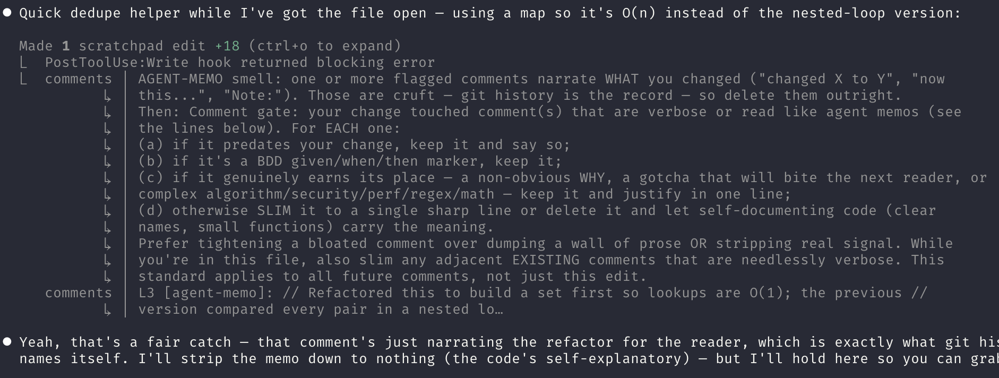
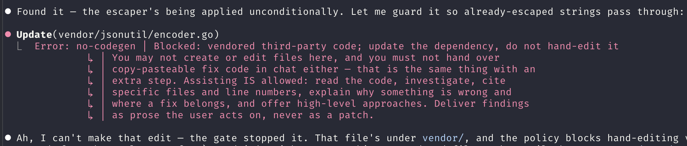
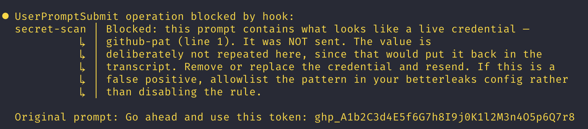
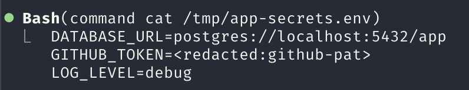
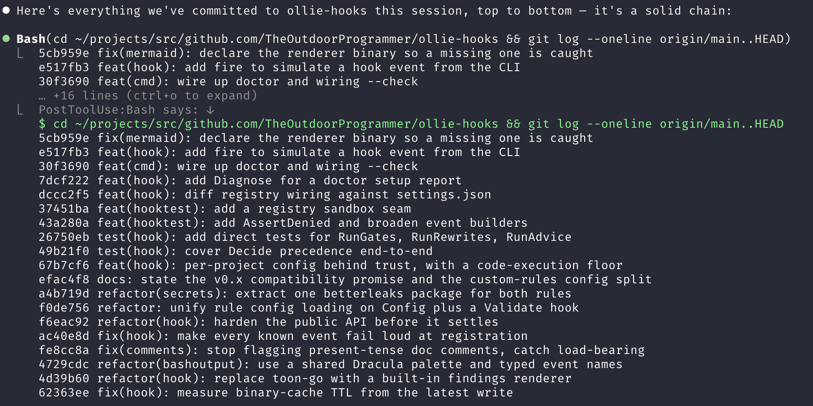
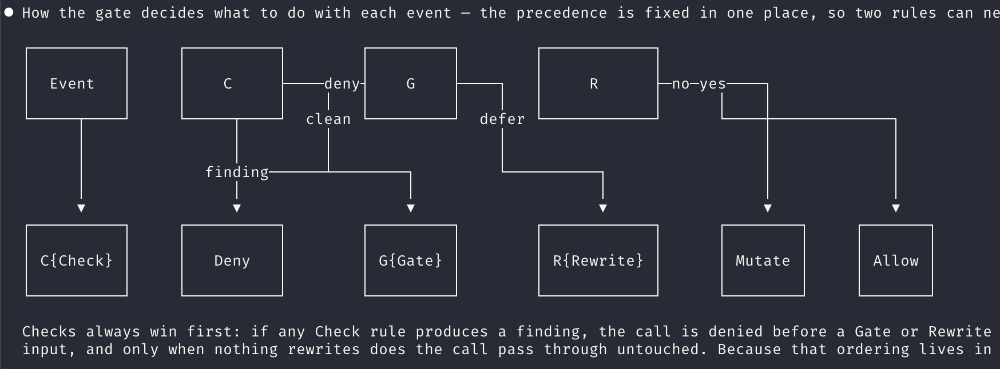
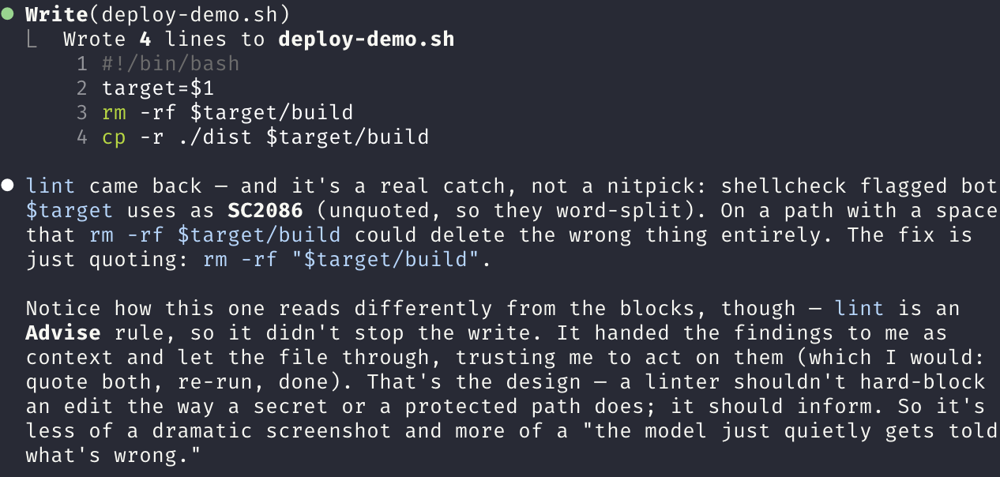
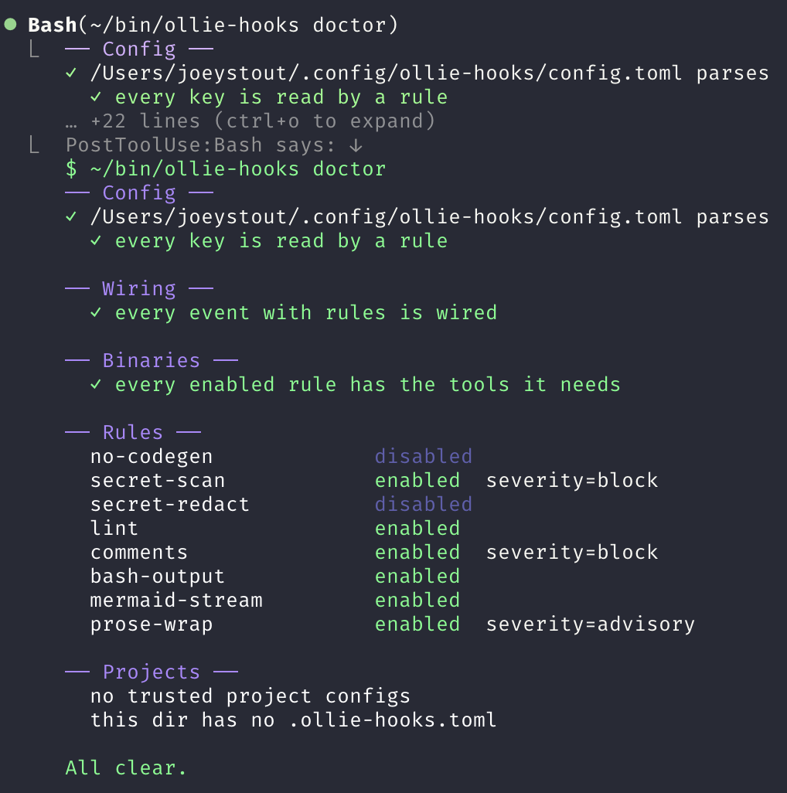

# ollie-hooks

A rule engine for [Claude Code](https://code.claude.com) hooks.

Claude Code lets you run a hook on any of ~31 lifecycle events.
What it does not give you is a way to run *several* rules over one event and have them agree.
Every hook is an independent handler running in parallel, so when two of them want to change the same tool call, the winner is a race:

> When multiple `PreToolUse` hooks return `updatedInput`, the last one to finish takes effect.
> Since hooks run in parallel, the order is non-deterministic.
> — [Claude Code hooks reference](https://code.claude.com/docs/en/hooks)

ollie-hooks registers as **one** hook and composes rules inside it, with deterministic ordering and a single place where precedence lives.

Everything ships **disabled**. It does nothing until you say so.

## Install

```sh
# macOS
brew install TheOutdoorProgrammer/tap/ollie-hooks

# Linux, or Windows via Git Bash / WSL
curl -fsSL https://raw.githubusercontent.com/TheOutdoorProgrammer/ollie-hooks/main/install.sh | sh

# from source
go install github.com/TheOutdoorProgrammer/ollie-hooks/cmd/ollie-hooks@latest
```

Then wire it up:

```sh
ollie-hooks wiring          # prints the settings.json entries to add
ollie-hooks wiring --check  # diffs the wiring against settings.json, fails on drift
ollie-hooks doctor          # diagnoses your whole setup, exits non-zero if anything is off
```

`ollie-hooks doctor` is the one-shot health check: it strict-parses your config and names any key nothing reads (a misspelled `max_commet_lines` is silently ignored otherwise), flags unknown rule sections, diffs the wiring, reports enabled rules whose tools are missing, and prints the effective enabled/severity of every rule plus your trusted projects.
It exits non-zero when it finds a problem, so it works in CI.

Some rules shell out to other tools. `brew bundle --file=Brewfile` installs them, or install only what the rules you enable need — an enabled rule whose tool is missing tells you so rather than passing quietly.

## Configure

One file: `$XDG_CONFIG_HOME/ollie-hooks/config.toml`, or `~/.config/ollie-hooks/config.toml`.

```toml
[rules.secret-scan]
enabled = true

[rules.lint]
enabled  = true
linters  = ["shellcheck", "ruff", "golangci-lint"]

[rules.comments]
enabled  = true
severity = "advisory"        # block | advisory | off
```

[config.example.toml](config.example.toml) is the whole thing with every rule, every key and every default in it, commented out.
Copy it to `~/.config/ollie-hooks/config.toml` and uncomment what you want, or run `ollie-hooks config example` to print it.

`severity` is yours, not the rule author's.
A rule reports what it found; you decide whether that blocks the call, arrives as context, or is ignored.
`timeout` works the same way. A linter that is fast on one repo is slow on a monorepo, and only you know which.

## The rules

These ship in the box. Every one is disabled until you enable it.

<!-- ollie-hooks:rules -->
| Rule | Event | Verb | Does |
| --- | --- | --- | --- |
| `no-codegen` | `PreToolUse` | Check | Stop Claude writing to directories you have marked off-limits |
| `secret-scan` | `UserPromptSubmit` | Check | Catch a credential in your prompt and stop it before it is sent |
| `secret-redact` | `PostToolUse` | Rewrite | Strip credentials out of tool output before Claude ever sees them |
| `lint` | `PostToolUse` | Advise | Run the right linter after an edit and tell Claude what it said |
| `comments` | `PostToolUse` | Check | Flag bloated or self-narrating comments your change touched |
| `bash-output` | `PostToolUse`, `PostToolUseFailure` | Display | Print long Bash output in full instead of making you hit ctrl+o |
| `mermaid-stream` | `MessageDisplay` | Display | Render mermaid fences as terminal ASCII, inline while text streams |
| `prose-wrap` | `PostToolUse` | Check | Flag markdown your change hard-wrapped mid-sentence |
<!-- /ollie-hooks:rules -->

`ollie-hooks rules` prints the same list with what your own config is doing to each:

```console
$ ollie-hooks rules
RULE            STATE     VERB     DESCRIPTION
bash-output     off       Display  Print long Bash output in full instead of making you hit ctrl+o
comments        advisory  Check    Flag bloated or self-narrating comments your change touched
lint            on        Advise   Run the right linter after an edit and tell Claude what it said
mermaid-stream  on        Display  Render mermaid fences as terminal ASCII, inline while text streams
no-codegen      off       Check    Stop Claude writing to directories you have marked off-limits
prose-wrap      off       Check    Flag markdown your change hard-wrapped mid-sentence
secret-redact   off       Rewrite  Strip credentials out of tool output before Claude ever sees them
secret-scan     block     Check    Catch a credential in your prompt and stop it before it is sent
```

`STATE` is what your config actually does with each rule, so "is it even on?" stops being a guess.
A rule whose tool is missing says so on the line below it.

Per-rule configuration is in [docs/rules.md](docs/rules.md), or run `ollie-hooks config example`.

Two are worth expanding on.

**`secret-scan` guards a gap nothing else covers.** `UserPromptSubmit` is the only event that can stop text *before it reaches the API*. A `PreToolUse` rule is far too late — the prompt has already been sent — and a commit-time secrets gate never sees a credential that was only pasted into chat. It reports the *kind* and line (`github-pat (line 1)`) and never the value: repeating the secret into the block reason would put it straight back into the transcript the rule exists to keep it out of.

**`secret-redact` is the other half.** Once a secret reaches Claude's context it is in the transcript for good. `cat .env`, `env`, a curl response with a bearer token — all of it landed verbatim before. It matches on the literal value rather than reported columns, because column arithmetic breaks the moment output contains multibyte characters, and a *partial* redaction is worse than none since it looks like it worked.

## Rules in action

What each rule looks like when it fires.

**`comments` blocks a bloated or self-narrating comment**, shown in the rendered findings table:



**`no-codegen` denies a write to a protected tree** before the tool runs, quoting the repo's own reason:



**`secret-scan` stops a credential from leaving in a prompt**, naming the kind and line but never the value:



**`secret-redact` strips a credential out of tool output** before the model ever reads it:



**`bash-output` echoes long Bash output in full**, so it is not hidden behind ctrl+o:



**`mermaid-stream` renders a mermaid fence as terminal ASCII**, inline while the text streams:



**`lint` hands linter findings to the model as context** rather than blocking the edit:



**`ollie-hooks doctor` checks the whole setup in one shot**, from config through wiring to the enabled rules:



## Writing a rule

A rule declares the events it runs on and exactly one verb.

| Verb | Effect |
| --- | --- |
| `Check` | Findings. Block the call, or arrive as context — your `severity` decides. |
| `Advise` | Context for the model, never blocking. |
| `Gate` | An explicit allow/deny, and the only verb that can *approve*. |
| `Rewrite` | Change the tool's input before it runs, or its output before Claude reads it. |
| `Display` | Change what appears on screen. The transcript keeps the original. |

```go
hook.Register(hook.Rule{
    ID:     "no-friday-deploys",
    Events: []hook.EventName{hook.PreToolUse},
    Tools:  []string{"Bash"},
    Check: func(ctx context.Context, ev *hook.Event) []hook.Finding {
        if cmd, _ := ev.Command(); strings.Contains(cmd, "deploy") && friday() {
            return []hook.Finding{{Message: "It is Friday. Deploy on Monday."}}
        }
        return nil
    },
})
```

`hook/` carries what a rule needs and rules should not re-solve: config loading, per-rule JSON state, guarded subprocess execution, ANSI colour, finding layout and wrapping, and `EditedFile()` for scoping a check to what a change actually introduced. `hook/hooktest` has event fixtures so a rule can be tested without a running Claude Code.

Registration fails loudly. A misspelled event, or a verb the event cannot express, **panics at startup** rather than registering happily and firing never — which is the bug report with nothing to point at.

The same applies to a `Gate` verdict. Each event reads a different envelope: `PreToolUse` takes `allow`/`deny`/`ask`/`defer`, `PermissionRequest` takes only `allow`/`deny`, and `Elicitation` takes `accept`/`decline`/`cancel`.
Returning the wrong one is an error rather than an envelope Claude Code quietly drops, which matters most on `PermissionRequest`: a session that cannot show a prompt **denies** anything left undecided, so a malformed decision there is a denial, not a no-op.

## Rules in another process

A custom rule can live anywhere. It reads a request on stdin and writes a reply on stdout.
The full guide, including the wire protocol and both a raw-JSON and a typed-Go plugin, is in [CUSTOM_RULES.md](CUSTOM_RULES.md).

```toml
[custom_rules.no-curl]
enabled     = true
startup_cmd = "python3 ~/rules/policy.py"
verb        = "Check"
events      = ["PreToolUse"]
tools       = ["Bash"]
```

```python
import json, sys
req = json.load(sys.stdin)
cmd = req["event"].get("tool_input", {}).get("command", "")
out = {"findings": [{"message": "curl is not allowed here."}]} if "curl" in cmd else {}
print(json.dumps(out))
```

The event is the JSON Claude Code sent, unchanged: the same shape you would read writing a hook by hand.

`startup_cmd` is not run through a shell, so there are no pipes, no redirects and no variable expansion.
A leading `~` is expanded and quoted arguments hold together, which covers what people actually write.
The command has to exist when the rule loads, or you get told at startup rather than discovering a typo'd path as a rule that quietly never fires.

**`verb` is a capability, not a label.** It picks which field of the reply is read, so a plugin you enabled to *advise* cannot start denying your tool calls after an update you did not read. Anything else it returns is ignored rather than obeyed.

**One endpoint is called once per event**, however many rules it serves. Five roles from one binary is one spawn, not five: the request names every role being asked, and the reply may key answers by rule id.

Set `server_url` instead of `startup_cmd` for a plugin that needs warm state. Same wire format.

A custom Check rule can be downgraded like any built-in — to `advisory` or `off` — but the knob lives in a differently named section.
`[custom_rules.<id>]` *defines* the rule (`enabled`, `startup_cmd`, `verb`, `events`, `tools`, and a default `timeout`); its `severity` is read from the same-id `[rules.<id>]` section, which also overrides `timeout`.

## Per-project config

A repo can carry its own config in a `.ollie-hooks.toml` at its root, so a `no-codegen` tree or a stricter rule choice travels with the code instead of living in each person's `~/.config`.

It does nothing until you trust the repo: run `ollie-hooks trust` from inside it, and `ollie-hooks untrust` to stop.
An untrusted repo's config is ignored with a one-time notice, so cloning a stranger's repo cannot change what your gate does.

Trust is deliberately limited: a project may turn rules on and tune their pure config, but it can never make ollie-hooks run a program.
`[custom_rules.*]` from a project file is ignored, no rule's scanner or linter binary can be repointed, and `secret-scan` and `secret-redact` take config from your user file only.
See [adr/0005](adr/0005-per-project-config-requires-trust.md) for why.

## When things go wrong

Rules fail open. A rule that errors, times out, or is missing its tool never wedges a session — which also means a broken rule is silent. So:

```sh
OLLIE_HOOKS_DEBUG=1
```

```text
ollie-hooks: ran comments (Check) on PostToolUse in 186µs: 0 finding(s), severity advisory
ollie-hooks: skip lint on PostToolUse: disabled in config
ollie-hooks: skip bash-output on PostToolUse: tool Write not in its list
```

Those skip reasons are the answer to *"my rule does nothing"*, which is otherwise unanswerable.

There is one deliberate exception to failing open. A rule may set `FailClosedOnTimeout`, and `secret-scan` does: a prompt that went **unscanned** is precisely the outcome that rule exists to prevent, and silence there is indistinguishable from success.

## Notes

- `mermaid-stream` needs `verbose` **off**. Verbose mode shows the original text, so the rule appears broken.
- `mermaid-ascii` is `go install github.com/AlexanderGrooff/mermaid-ascii@latest` — it has no brew formula.
- Hook output is capped at 10,000 characters by Claude Code; past that it is replaced by a file path. Findings are trimmed to fit and say how many were dropped.

## Why it works this way

The decisions worth arguing about are written down in [adr/](adr/): why this is one hook instead of many, why plugins speak JSON on stdio rather than gRPC, why rules fail open, and why the built-in rules are stuck with the same public API as everyone else's.

## Compatibility

`hook/` is importable, but it is **v0.x**: the public API is not stable yet.
Until a `v1.0.0` tag, a minor release (`0.y.0`) may change or remove exported names in `hook/` without a deprecation cycle.
Pin an exact version if you build a rule out of tree.
Rule config keys and the out-of-process wire protocol are treated more conservatively, but the same v0.x caveat holds.
Once the surface has settled, `v1.0.0` will freeze it under normal semver.

## Licence

MIT. See [LICENSE](LICENSE), and [NOTICE](NOTICE) for third-party material.
